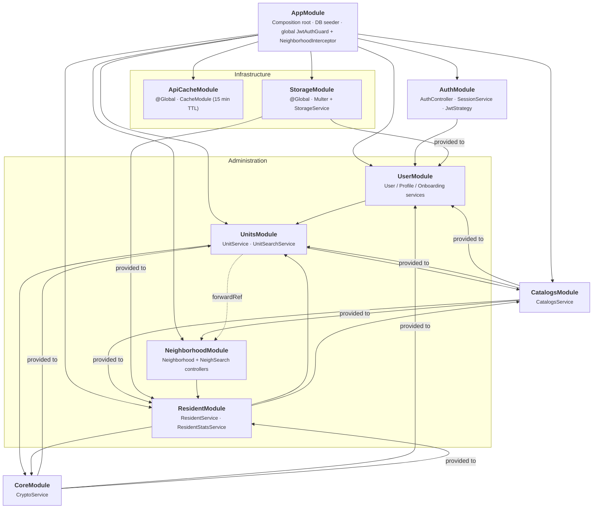

# API Modules

Dependency graph of the NestJS modules in `apps/api/src`. Solid arrows = module import; dashed = `forwardRef` circular dependency. `@Global` modules are injectable everywhere without importing.

## Routes

All under the global `api/` prefix:

| Module | Controller | Route |
|---|---|---|
| Auth | `AuthController` | `auth` |
| Catalogs | `CatalogsController` | `catalogs` |
| Neighborhood | `NeighborhoodController`, `NeighSearchController` | `neighborhood` |
| Units | `UnitsController` | `neighborhood/:neighborhoodId/units` |
| Residents | `ResidentController` | `neighborhoods/:neighborhoodId/residents` |
| User | `UserController`, `ProfileController`, `OnboardingController` | `user`, `user/profile`, `onboarding` |

## Notes

- `UnitsModule` ↔ `NeighborhoodModule` is the only circular dependency, resolved via `forwardRef`.
- `ApiCacheModule` and `StorageModule` are `@Global`; `UserModule`/`ResidentModule` still import `StorageModule` explicitly (redundant but harmless).
- Auth exposes nothing; other modules depend on `UserModule`, not `AuthModule`.