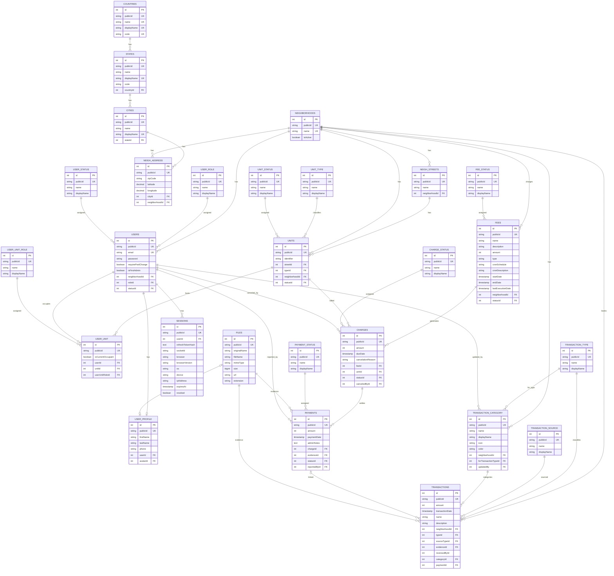

# Database Schema

TypeORM entity schema (`synchronize: true`, no migrations). Entities are registered in `apps/api/src/_core/database/entities/index.ts`.

## Legend

- `UK` — unique index. Every table has `id` (PK, exposed as UUID `publicId`).
- **Base classes** (no tables of their own): `BaseEntity` → `id` + `publicId`; `BaseCatalog` adds `name` + `displayName`; `BaseTraceableEntity` is everything in `BaseEntity` plus the audit trail.
- **Audit trail** — all tables marked traceable add `createdAt`, `createdBy`, `updatedAt`, `updatedBy`, `deletedAt` (soft delete), `deletedBy`, with `createdBy`/`updatedBy`/`deletedBy` referencing `users.id`. Catalog tables (`user_role`, `user_status`, `user_unit_role`, `unit_type`, `unit_status`, `fee_status`, `charge_status`, `payment_status`, `transaction_type`, `transaction_source`) extend `BaseCatalog`; `transaction_category` is a `BaseCatalog` with a partial audit trail.
- Location hierarchy is zero-redundancy: `neigh_address` stores only `city_id` (never `state_id`/`country_id`).

## Known schema quirks

- `charges.feedId` — orphan column from a typo; the actual FK to `fees` is `feeId`.
- `transactions.reversedById` — declared NOT NULL but has no FK relationship.
- `transactions.category` property is mis-typed as `Payment`; the FK `categoryId` correctly points at `transaction_category`.
- `sessions.socketId` maps to DB column `socketid`.